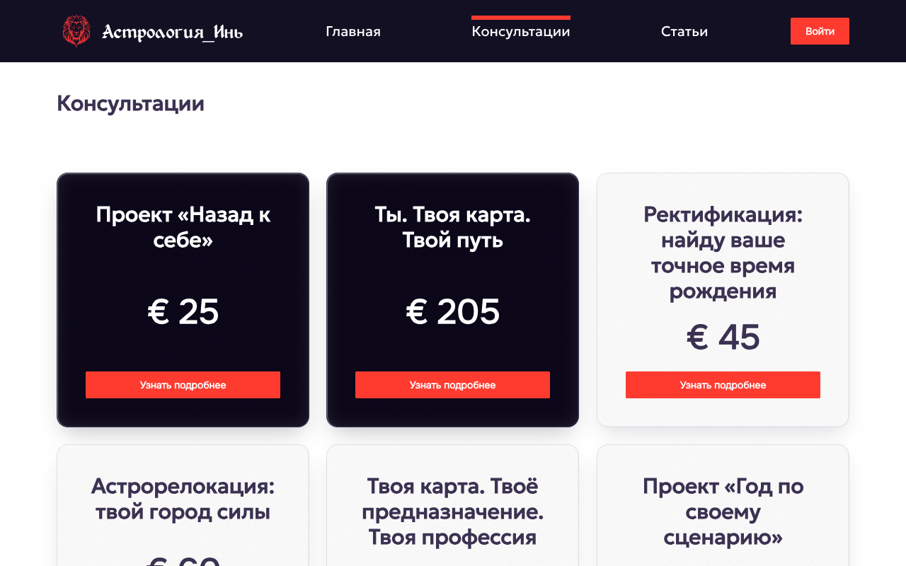

# Астрология_Инь - astrology consultations website

A production web app for a personal astrologer. Users browse consultations, pay by bank transfer, earn bonus points, invite friends and manage their account. The site owner has an admin panel and can send email campaigns to users.

The UI is in Russian. The code, comments and this document are in English.

Live site: [astrology-yin.vercel.app](https://astrology-yin.vercel.app/)

Solo project. Built with Next.js 15 (App Router), TypeScript, Prisma and PostgreSQL. Deployed on Vercel.




## Table of contents

- [Features](#features)
- [Tech stack](#tech-stack)
- [Architecture](#architecture)
- [Project structure](#project-structure)
- [Database](#database)
- [Getting started](#getting-started)
- [Scripts](#scripts)
- [Deployment](#deployment)
- [Development workflow](#development-workflow)
- [Known limitations and next steps](#known-limitations-and-next-steps)
- [License](#license)

## Features

### For visitors and users

- Consultation catalogue with detail pages. Consultations live in PostgreSQL and have a status (`PUBLISHED`, `PENDING`, `DEPRECATED`). Only `PUBLISHED` ones are shown in production.
- Sign up, log in, log out and password reset by email link. All of it happens in modals, without leaving the page.
- Payment by bank transfer. The user gets the bank details, pays, then sends the payment reference for a check. The purchase status (`CHECKING` -> `CONFIRMED`) is visible in the account.
- Bonus program. Points for registration, extra points for registering with a friend's email, and 10% of each purchase made by an invited friend. Points can cover up to 20% of a consultation price.
- Account area: purchases, bonuses and spending history, invited friends, personal details, email notification settings, support contacts.
- Articles section with static content.
- Responsive layout with a mobile menu, skeleton loading states, toasts, and a 3D tilt effect on consultation cards that turns off when the user prefers reduced motion.

### For the admin

- User list with a delete action.
- Email campaigns: send a new article or a new consultation to all users who opted in. The app records who already got each email, so nobody gets it twice.
- Feature flags stored in the database (`SIGN_UP_PROMPT`, `BONUS_PROGRAM`) to switch parts of the UI without a deploy.

## Tech stack

| Area                    | Tools                                                                                   |
| ----------------------- | --------------------------------------------------------------------------------------- |
| Framework               | Next.js 15 (App Router, Route Handlers), React 18, TypeScript (strict mode)             |
| Database                | PostgreSQL (Vercel Postgres), Prisma 6                                                  |
| State and data fetching | Redux Toolkit, RTK Query                                                                |
| Styling                 | Tailwind CSS 3, local fonts via `next/font/local`, a few CSS/SCSS modules               |
| Forms and UI            | react-hook-form, react-modal, react-toastify, react-loading-skeleton, @react-spring/web |
| Auth                    | `jose` (HS256 JWT) in an httpOnly cookie, `bcrypt` password hashing                     |
| Email                   | nodemailer over SMTP with a shared HTML template                                        |
| Analytics               | @vercel/analytics, @vercel/speed-insights                                               |
| Tooling                 | ESLint (`next/core-web-vitals`), Prettier, `tsc --noEmit`                               |
| Hosting                 | Vercel, deploys from `main`                                                             |

## Architecture

Request flow:

```
React component
  -> RTK Query hook        store/features/api/subApi/*
  -> Route Handler         app/api/**/route.ts
  -> service               server/services/*
  -> Prisma client         lib/prisma.ts
  -> PostgreSQL
```

Key points:

- All server data goes through RTK Query endpoints. Components never call `fetch` directly. Cache tags (`Users`, `Consultation`, `Purchase`, `Wallet`, `Bonus`, ...) keep the UI in sync after mutations.
- Route Handlers are thin. They parse the request, call a service and return JSON. Errors go through `ApiError` (`server/error/ApiError.ts`) and come back as `{ success: false, message }` with a user-facing message that the client shows as is.
- Services are plain async functions, one file per domain (`userService`, `purchaseService`, `bonusService`, `walletService`, `mailService`, ...). DTOs in `server/dtos/*` decide which fields reach the client, so password hashes and tokens never leave the server.
- Auth: on login the server signs a JWT with `jose`, saves it in the `Token` table and sets it as an httpOnly cookie. Every protected handler reads the user from that cookie. Admin-only routes also check `role === "ADMIN"` on the server. Client-side guards (`useAuthorizedRoute`, `useAdminRoute`) are for UX only.
- Pages are thin `export default` wrappers. UI logic lives in route-local components (`app/<route>/components/*`). Heavy or browser-only UI (modals, mobile menu, payment widgets) loads with `next/dynamic` and `ssr: false`.
- Feature flags are rows in the `FeatureFlag` table, read through an RTK Query endpoint.
- Emails use nodemailer over SMTP with one HTML template (`server/helpers/email/emailTemplate.ts`) for registration, password reset, payment check and campaigns.

## Project structure

```
app/                     routes (App Router)
  _components/           shared UI: primitives, modals, toasts, app shell
  account/               user account pages (bonuses, friends, purchases, ...)
  admin/                 admin panel
  api/**/route.ts        Route Handlers - the only backend entry points
  article/               articles (static content)
  bonus-program/         bonus program explanation page
  consultation/          catalogue and consultation detail pages
  constants/             validation rules, UI messages, brand
server/
  services/              business logic, one file per domain
  dtos/                  response shapes sent to the client
  helpers/               env access, JWT secrets, email template
  error/ApiError.ts      error protocol
store/                   Redux store, slices and RTK Query endpoints
models/                  request and response types that extend Prisma types
prisma/                  schema.prisma, seed.ts, enumAdapter.ts
lib/prisma.ts            Prisma client singleton
utils/                   helpers and hooks (formatting, validation, auth guards)
scripts/backup-db.sh     pg_dump backup script
middleware.ts            guards GET /api/users/:id
```

## Database

Main models in `prisma/schema.prisma`:

- `Users` - account, role (`USER` / `ADMIN`), email notification flag, referral email
- `Token` - refresh tokens per user
- `Consultation` - catalogue item with price, currency and status
- `Banking` - bank accounts that accept payments
- `Purchase` - a user's payment for a consultation, with payment and fulfilment status
- `Wallet` and `Bonus` - bonus balance and the history of every bonus
- `Friend` - who invited whom
- `PasswordResetLink` - one-time reset links with a state (`PENDING`, `REQUESTED`, `USED`)
- `ArticleEmail`, `ConsultationEmail` - which users already received a campaign
- `FeatureFlag` - runtime switches for the UI

The project uses `prisma db push` and has no migrations folder. `prisma/seed.ts` holds the consultation seed data and only inserts titles that are not in the database yet; it never updates existing rows. Its `main()` call is commented out, so the seed is a no-op until you enable it.

Take a backup before any schema change:

```bash
npm run db-backup        # custom format (.dump), best for restore
npm run db-backup:sql    # plain SQL
npm run db-backup:both   # both formats
```

Backups go to the gitignored `backups/` folder. The script keeps the last 5 files of each format.

## Getting started

Prerequisites: Node.js 20 or newer, npm, a PostgreSQL database, and an SMTP account for outgoing email.

1. Install dependencies:

```bash
npm install
```

2. Create `.env` in the repo root. If the project is linked to Vercel, `vercel env pull .env` fills it. Otherwise set these variables by hand:

| Variable                                                                           | Purpose                                                                            |
| ---------------------------------------------------------------------------------- | ---------------------------------------------------------------------------------- |
| `POSTGRES_PRISMA_URL`                                                              | pooled connection string used by Prisma at runtime                                 |
| `POSTGRES_URL_NON_POOLING`                                                         | direct connection string for `db push`, seed and backups                           |
| `JWT_REFRESH_SECRET`, `JWT_ACCESS_SECRET`                                          | secrets for signing JWTs                                                           |
| `VERCEL_SMTP_HOST`, `VERCEL_SMTP_PORT`, `VERCEL_SMTP_USER`, `VERCEL_SMTP_PASSWORD` | SMTP account for outgoing email                                                    |
| `VERCEL_DEFAULT_RESET_PASSWORD`                                                    | temporary password set after a password reset                                      |
| `VERCEL_ENV`                                                                       | `development`, `preview` or `production`; controls which consultations are visible |
| `VERCEL_URL`                                                                       | public URL used in email links; Vercel sets it in deployments                      |
| `ADMIN_EMAILS`                                                                     | comma-separated emails that get the `ADMIN` role on registration (optional)        |

3. Create the tables:

```bash
npx prisma db push
```

4. Start the dev server:

```bash
npm run dev
```

Open http://localhost:3000. Add consultations and bank details through Prisma Studio (`npm run prisma-studio`) or enable the seed.

## Scripts

| Command                                                       | What it does                                                                                                                                                |
| ------------------------------------------------------------- | ----------------------------------------------------------------------------------------------------------------------------------------------------------- |
| `npm run dev`                                                 | `prisma generate`, then Next.js in dev mode                                                                                                                 |
| `npm run lint`                                                | ESLint (`next lint`)                                                                                                                                        |
| `npm run typecheck`                                           | `tsc --noEmit`                                                                                                                                              |
| `npm run format` / `npm run format:check`                     | Prettier                                                                                                                                                    |
| `npx next build`                                              | local production build check                                                                                                                                |
| `npm run build`                                               | Vercel build command: `prisma generate`, `prisma db push`, `prisma db seed`, `next build`. It writes to the configured database, so it is not a local check |
| `npm run start`                                               | serve the production build                                                                                                                                  |
| `npm run prisma-studio`                                       | open Prisma Studio                                                                                                                                          |
| `npm run prisma-db-push` / `prisma-db-pull` / `prisma-format` | Prisma helpers                                                                                                                                              |
| `npm run db-backup`                                           | `pg_dump` snapshot (see [Database](#database))                                                                                                              |

## Deployment

The site is hosted on Vercel and deploys automatically from `main`. The build command (`npm run build`) syncs the schema with `prisma db push` and runs the seed, so every deploy keeps the database in step with the code. `VERCEL_ENV` and `VERCEL_URL` are set by Vercel.

## Development workflow

- Small, safe changes go straight to `main`. Larger work goes on `feature/<slug>` or `fix/<slug>` branches with a pull request.
- Commit messages follow Conventional Commits (`feat: ...`, `fix: ...`, `chore: ...`).
- The repo ships an agent kit for AI-assisted development. `AGENTS.md` is the entry point for Cursor and Claude Code. `.cursor/rules/*.mdc` hold the coding rules (data layer, API and Prisma, styling, Russian UX copy). `.cursor/skills/*` are reusable workflows for planning, feature work, bug fixing, code review, schema changes and browser QA. `bin/git-guard` runs as a shell hook and blocks dangerous git commands such as force pushes, remote branch deletion and `--no-verify`.
- "Done" means `typecheck`, `lint` and `npx next build` are green and the changed flow was checked in the browser.

## Known limitations and next steps

- No automated tests yet. Verification is `typecheck`, `lint`, `next build` and manual browser QA. Component tests for the forms and integration tests for the Route Handlers are the next step.
- Payment confirmation is a manual step for the site owner. There is no payment provider integration.
- `app/admin/account` is an older copy of `app/account`. The plan is to merge them into one component tree with an admin flag.

## License

The code is released under the [MIT License](LICENSE). The brand name, consultation texts, articles and photos belong to the site owner and are not covered by the license.
